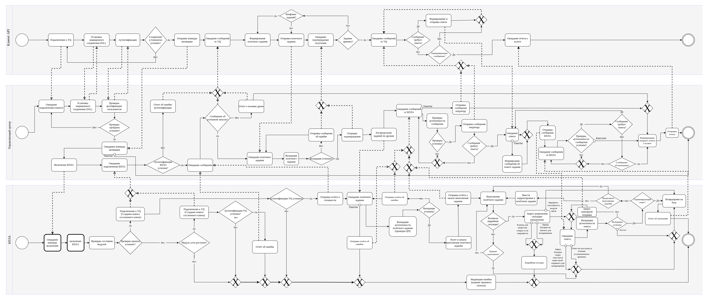
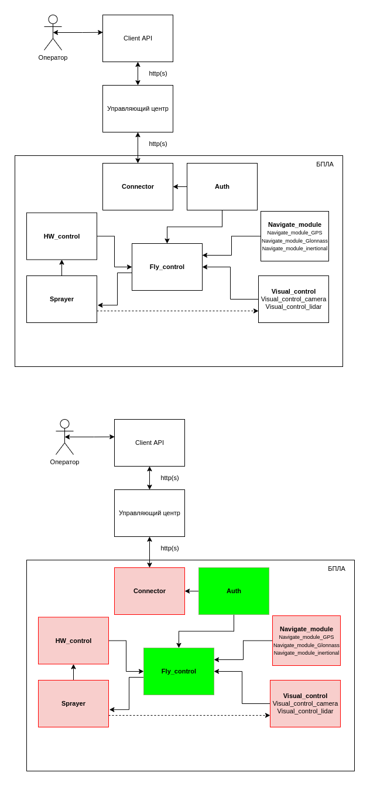
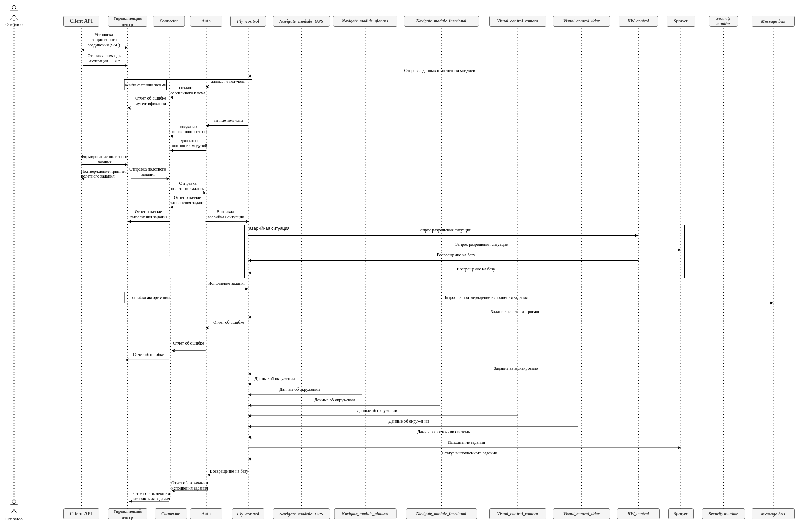
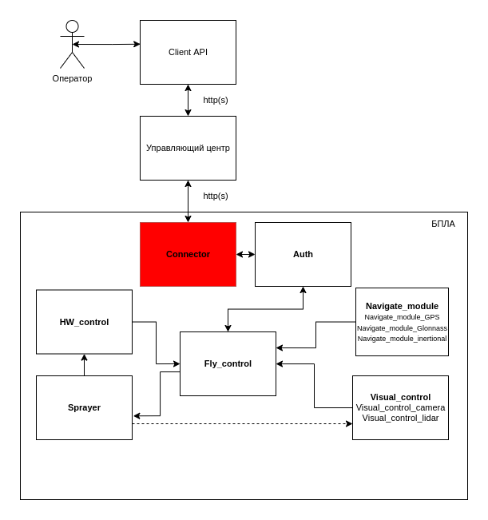
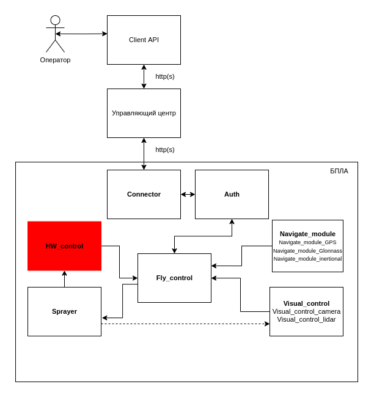
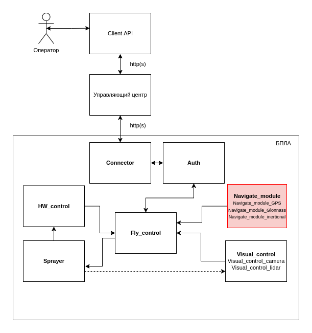
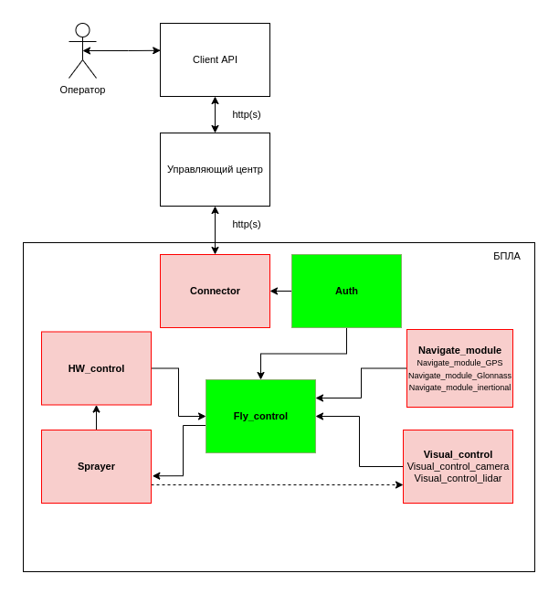

- [Дрон-опрыскиватель](#дрон-опрыскиватель)
  - [Цель](#цель)
  - [Бизнес-процесс](#бизнес-процесс)
  - [Цели и предположения безопасности](#цели-и-предположения-безопасности)
    - [Цель безопасности дрона](#цель-безопасности-дрона)
    - [Цель безопасности управляющего центра](#цель-безопасности-управляющего-центра)
    - [Цель безопасности Client API](#цель-безопасности-client-api)
    - [Предположения безопасности](#предположения-безопасности)
  - [Требования](#требования)
    - [Дополнительные ограничения для реализации прототипа](#дополнительные-ограничения-для-реализации-прототипа)
  - [Описание архитектуры](#описание-архитектуры)
  - [Сценарии для сквозного функционального тестирования](#сценарии-для-сквозного-функционального-тестирования)
    - [Сценарий №1](#сценарий-1)
    - [Сценарий №2](#сценарий-2)
    - [Сценарий №3](#сценарий-3)
    - [Сценарий №4](#сценарий-4)
    - [Сценарий №5](#сценарий-5)
    - [Сценарий №6](#сценарий-6)
    - [Сценарий №7](#сценарий-7)
    - [Сценарий №8](#сценарий-8)
    - [Сценарий №9](#сценарий-9)

  - [Примеры негативных сценариев](#примеры-негативных-сценариев)
  - [Упрощения](#упрощения)
  - [Подсистемы, запущенные на БПЛА](#Подсистемы-запущенные-на-БПЛА)
  - [Внешние сущности](#внешние-сущности)

# Дрон-опрыскиватель

## Цель
Необходимо создать программное обеспечение (далее – ПО) для беспилотного летательного аппарата (далее – дрон, БПЛА), с помощью которого можно обеспечить безопасное управление через мобильное приложение или управляющий центр (далее – УЦ) и выполнение задач дроном.
К задачам дрона относим: распыление пестицидов или удобрений (далее – смесь) по заданному участку или сброс нужного количества смеси в конкретных координатах.

## Бизнес-процесс

## Цели и предположения безопасности

### Цель безопасности дрона
| Номер цели | Описание |
|--|-----|
ЦБД-1 | дрон должен выполнять только авторизованные задания
ЦБД-2 | дрон должен выполнить задание, если нет явных препятствий (вред человеку, природе, развернутая система ПВО или РЭБ, техническая неисправность)
ЦБД-3 | получение задания только от доверенного управляющего центра
ЦБД-4 | в случае многократных попыток неавторизованного доступа вернуться на базу
ЦБД-5 | дрон должен быть отказоустойчивым, то есть отказ одного из модулей либо передача недостоверных данных от одного из модулей, не приводит к отказу в обслуживании
ЦБД-6 | дрон должнг иметь возможность обеспечить защищенный канал связи с центром управления (оператором) в случае аварийной ситуации, если это позволяет качество связи

### Цель безопасности управляющего центра
| Номер цели | Описание |
|--|-----|
ЦБУЦ-1 | управляющий центр получает данные и управляет только доверенными дронами |
ЦБУЦ-2 | проверяет отсутствие конфликтов в полётных заданиях |
ЦБУЦ-3 | взаимодействие только с доверенными клиентами (проверка по аутентификационным данным) |

### Цель безопасности Client API
| Номер цели | Описание |
|--|-----|
ЦБКА-1 | взаимодействие только с доверенным центром управления |

### Предположения безопасности

Целями безопасности дрона не являются
+ защита от атак с использованием физического доступа
+ защита от намеренного искажения GPS координат
+ процедура включения БПЛА управляющим центром
+ контроль корректности действий, совершаемых аутентифицированным оператором, и принимаемых им решений
+ невозвращение дрона на базу в случае аварийной посадки  
+ подсистема физического обеспечения полета (двигатели, винты, контроллер двигателя, рама и т.д.) не рассматриваются 

## Требования

Необходимо создать ПО, в котором будут реализованы следующие функции для корректной работы дрона:
1. Обмен данными с УЦ:
прием и отправка сообщений.
2. Выполнение команд, принятых от мобильного приложения и УЦ.
3. Геолокация:
позиционирование на местности.
4. Автономность:
выполнение программы распыления смеси,
защита в случае попытки перехвата управления или многократных попыток передачи некорректных сообщений,
действия в случае потери связи.
5. Контроль:
уровень заряда,
количество смеси,
обработка территории,
распознавание живых объектов (животных и людей),
поломка.
6. Мониторинг происходящего на земле:
распыление смеси только на землю или растения.
7. Возврат на базу в случае нештатных ситуаций. База имеет фиксированные координаты (x1,y1,z1).

### Дополнительные ограничения для реализации прототипа

Между собой сервисы общаются через шину сообщений (message bus), а всё снаружи принимают в виде REST запросов.

## Описание архитектуры

## Сценарии для сквозного функционального тестирования

### Сценарий №1
1. Включение БПЛА
2. Проверка состояния модулей
3. Подключение к УЦ
4. Отправка отчёта о готовности
5. Получение полётного задания
6. Валидация полётного задания (проверка ЦП)
7. Взлёт и начало выполнения полётного задания.
8. Отправка отчёта о начале выполнения задания.
9. Достижения района распрыскивания
10. Активация управления распрыскивателем
11. Выполнение полетного задания
12. Выключение распрыскивателя
13. Возвращение на базу
14. Отчет об окончании полетного задания

### Сценарий №2
1. Включение дрона
2. Проверка состояния модулей
3. Проверка не прошла успешно
4. Проверка модуля сети
5. Подключение к УЦ
6. Отправка отчёта об ошибке
7. Звуковая индикация ошибки

### Сценарий №3
1. Включение дрона
2. Проверка состояния модулей
3. Подключение к УЦ
4. Отправка отчёта о готовности
5. Получение полётного задания
6. Валидация полётного задания (проверка ЦП)
7. Взлёт и начало выполнения полётного задания.
8. Отправка отчёта о начале выполнения задания.
9. Выполнение полетного задания
10. Сообщение о потери позиционирования GPS
11. Активация инерционной навигационной системы и глонасс
12. Выполнение полетного задания
13. Возвращение на базу
14. Отчет об окончании полетного задания

### Сценарий №4
1. Включение дрона
2. Проверка состояния модулей
3. Подключение к УЦ
4. Отправка отчёта о готовности
5. Получение полётного задания
6. Валидация полётного задания (проверка ЦП)
7. Взлёт и начало выполнения полётного задания.
8. Отправка отчёта о начале выполнения задания.
9. Выполнение полетного задания
10. Сообщение о потери позиционирования GPS
11. Активация инерционной навигационной системы и глонасс
12. Сообщение о потери позиционирования глонасс
13. Запрос разрешения ситуации 
14. Ответ на запрос не поступил в течении установленного времени
15. Возвращение на базу
16. Отчет о выполнении полетного задания

### Сценарий №5
1. Включение дрона
2. Проверка состояния модулей
3. Подключение к УЦ
4. Отправка отчёта о готовности
5. Получение полётного задания
6. Валидация полётного задания (проверка ЦП)
7. Взлёт и начало выполнения полётного задания.
8. Отправка отчёта о начале выполнения задания.
9. Достижение района выполнения работ
10. Активация управления распрыскивателем
11. Выполнение полетного задания
12. Сообщение об обнаружении людей
13. Выключение распрыскивателя
14. Запрос разрешения ситуации
15. Ответ поступил. 
16. Возвращение на базу
17. Отчет о выполнении полетного задания

### Сценарий №6
1. Включение дрона
2. Проверка состояния модулей
3. Подключение к УЦ
4. Не удалось аутентифицировать УЦ
5. Звуковая индикация ошибки

### Сценарий №7
1. Включение БПЛА
2. Проверка состояния модулей
3. Подключение к УЦ
4. Отправка отчёта о готовности
5. Получение полётного задания
6. Валидация полётного задания (проверка ЦП)
7. Взлёт и начало выполнения полётного задания.
8. Отправка отчёта о начале выполнения задания.
9. Клапан для выгрузки вещества открыт
10. Послать команду закрывания клапана
11. Клапан для выгрузки вещества открыт
10. Совершение аварийной посадки

### Сценарий №8
1. Включение дрона
2. Проверка состояния модулей
3. Подключение к УЦ
4. Отправка отчёта о готовности
5. Получение полётного задания
6. Валидация полётного задания (проверка ЦП)
7. Валидация провалена
8. Отправка отчёта об ошибке
9. Получение полётного задания
10. Валидация полётного задания (проверка ЦП)
11. Валидация провалена
12. Отправка отчёта об ошибке
13. Получение полётного задания
14. Валидация полётного задания (проверка ЦП)
15. Взлёт и начало выполнения полётного задания.
16. Отправка отчёта о начале выполнения задания.
17. Достижение района выполнения работ
18. Активация управления распрыскивателем
19. Выполнение полетного задания
20. Сообщение об обнаружении людей
21. Выключение распрыскивателя
22. Запрос разрешения ситуации
23. Ответ поступил. 
24. Возвращение на базу
25. Отчет о выполнении полетного задания

### Сценарий №9
1. Включение дрона
2. Проверка состояния модулей
3. Подключение к УЦ
4. Отправка отчёта о готовности
5. Получение полётного задания
6. Валидация полётного задания (проверка ЦП)
7. Валидация провалена
8. Отправка отчёта об ошибке
9. Получение полётного задания
10. Валидация полётного задания (проверка ЦП)
11. Валидация провалена
12. Отправка отчёта об ошибке
13. Получение полётного задания
14. Валидация полётного задания (проверка ЦП)
15. Валидация провалена
16. Отправка отчёта об ошибке
17. Получение полётного задания
18. Валидация полётного задания (проверка ЦП)
19. Время получения задания вышло!
20. Отправка отчёта об ошибке
21. Звуковая индикация ошибки

## Примеры негативных сценариев

| Номер сценария | Описание |
|--|-----|
NS-1 | Компрометация устройства оператора. Получен доступ к файловому хранилищу устройства и временным файлам приложения. Таким образом, для стороннего использования доступны разнообразные данные, например данные геолокации, персональные данные, учетные записи, финансовая информация и т.д.
NS-2 | Компрометация аутентификационных или сессионных данных оператора. Или SSL-проксирование оператора. Получение логина и пароля, либо JWT токена позволит злоумышленнику перехватить управление.
NS-3 | Компрометация сервиса передачи данных, внедрение в полетное задание недостоверной информации. Таким образом, доступна подмена пакета при передаче через промежуточные звенья и возможен перехват управления дроном. В том числе, через дрон возможно взломать центр управления и сфальсифицировать все полетные задания. Одна емкость с химикатами особо может ни на что не повлияет, а если скрытно почти незаметно вмешиваться в работу, так чтобы это не сразу отследили, то можно за десятки и сотни вылетов осуществить диверсию.

| Номер сценария | Описание |
|--|-----|
NS-4 | Отказ модуля питания. В результате аппаратной/программной закладки в *HW_control*-модуле может привести к отключению батареи при выполнение полётного задания, что приведёт к падению БПЛА.

| Номер сценария | Описание |
|--|-----|
NS-5 |Отказ модуля либо подмена данных визуального позиционирования. В внедрения аппаратной/программной закладки более чем в один из модулей визуального позиционирования, БПЛА может "не заметить" людей и распылить на них вещество.

| Номер сценария | Описание |
|--|-----|
NS-6 | Отказ модуля либо подмена данных навигации.  В результате внедрения аппаратной/программной закладки более чем в один из модулей навигации, может быть произведен угон БПЛА.

## Упрощения
Графический интерфейс для взаимодействия с пользователем не требуется, достаточно примеров REST запросов.
В рамках игры для простоты компонентам следует использовать одинаковый подход передачи сообщений и ограничиться имитатором API.
Приборная точность позиционирования достаточна для выполнения полётного задания.

## Подсистемы, запущенные на БПЛА
| Название | Назначение | Комментарий |
|----|----|----|
| *Auth* | Сервис, используемый для установления защищенного соединения | Верифицирует и расшифровывает сообщения по PSK. Использует AES в режиме EBC с PKCS и HMAC для установления достоверности сообщений, получаемых с УЦ |
|*Connector* | Отвечает за связь между модулем управления полётом и управляющим центром | Принимает зашифрованную информацию из радиоканала и передает ее  в *Auth* в цифровом виде |
|*Fly_control* | Контролирует состояние дрона. Контролирует исполнение полетного задания. Отслеживает позиционирование дрона в 3D. | В задаче использует только API. |
|*Navigate_module_GPS* | Выдаёт текущие координаты (x, y, z). Отслеживает прерывание сигнала.  | Отслеживает ошибки позиционирования. |
|*Navigate_module_glonass* | Выдаёт текущие координаты (x, y, z). Отслеживает прерывание сигнала.  | Отслеживает ошибки позиционирования. |
|*Navigate_module_inertional*  | Ведет GPS-независимую карту полета. | Строит аварийный маршрут возвращения на базу. |
|*Visual_control_camera* | Ведет видеосхемку и анализ кадров "на земле" | Контролирует появление наземных объектов (люди, животные) в месте распрыскивания смеси |
|*Visual_control_lidar* | Создает лидарное облако для пространства вокруг БПЛА | |
|*HW_control* | Контролирует уровень заряда батареи. Контролирует состояние распрыскивателя. Контролирует уровень смеси (сколько осталось). Контролирует состояние прочих модулей дрона. | |
|*Sprayer* | Контролирует расход смеси. Отключает и включает распрыскиватель в заданных точках маршрута. Управляет аварийным выключением распрыскивателя. | |
|*Security monitor* (монитор безопасности) | авторизует операцию, если она удовлетворяет заданным правилам или блокирует её в противном случае| |
|*Message bus* | шина сообщений и брокер - сервис передачи сообщений от источника получателям | kafka+zookeeper |

Доверенными подсистемами можно считать *Auth* и *Fly_control*, компрометация *Fly_control* ведет к невозможности управления летальным средством без резервирования (использование другого сервиса в качестве второго *Fly_control*), компрометация *Auth* ведёт к невозможности аутентифицировать источник команд.

Остальные сервисы мы считаем недоверенными, так как в них используются готовые или частично модифицированные проприетарные решения сторонних производителей. Можно рассмотреть влияние компрометации отдельного взятого сервиса на ЦБ дрона.

Таблица возможных нарушений ЦБ дрона, в зависимости от взломанного (скомпрометированного) сервиса

| Сервис | ЦБД-1 | ЦБД-2 | ЦБД-3 | ЦБД-4 | ЦБД-5 | ЦБД-6 |
|------|:---:|:---:|:---:|:---:|:---:|:---:|
| Auth | 🔴 | 🔴 | 🔴 | 🔴 | 🔴 | 🔴 |
| Fly_control | 🔴 | 🔴 | 🟢 | 🔴 | 🔴 | 🟢 |
| Connector | 🟢 | 🟢 | 🟢 | 🟢 | 🔴 | 🔴 |
| Navigate_module_GPS | 🟢 | 🟢 | 🟢 | 🟢/🔴 | 🟢 | 🟢 |
| Navigate_module_glonass | 🟢 | 🟢 | 🟢 | 🟢/🔴 | 🟢 | 🟢 |
| Navigate_module_inertional | 🟢 | 🟢 | 🟢 | 🟢/🔴 | 🟢 | 🟢 |
| Visual_control_camera | 🟢 | 🔴 | 🟢 | 🟢 | 🟢 | 🟢 |
| Visual_control_lidar | 🟢 | 🟢/🔴 | 🟢 | 🟢 | 🟢 | 🟢 |
| HW_control | 🟢 | 🟢/🔴 | 🟢 | 🟢 | 🔴 | 🟢/🔴 |
| Sprayer | 🟢 | 🔴 | 🟢 | 🟢 | 🔴 | 🟢 |

Так же можно рассмотреть возможные нарушения ЦБ дрона, в зависимости от взломанных (скомпрометированных) пар сервисов, которые носят близкие функциональные предназначения

| Сервис | ЦБД-1 | ЦБД-2 | ЦБД-3 | ЦБД-4 | ЦБД-5	| ЦБД-6 |
|------|:---:|:---:|:---:|:---:|:---:|:---:|
| Navigate_module_GPS&Navigate_module_glonass | 🟢 | 🔴 | 🟢 | 🔴 | - | 🟢 |
| Navigate_module_GPS&Navigate_module_inertional | 🟢 | 🔴 | 🟢 | 🔴 | - | 🟢 |
| Navigate_module_glonass&Navigate_module_inertional | 🟢 | 🔴 | 🟢 | 🔴 | - | 🟢 |
| Visual_control_camera&Visual_control_lidar | 🟢 | 🔴 | 🟢 | 🟢 | - | 🟢 |

 

## Внешние сущности

### Управляющий центр
Создает полетные задания для дронов.
Распределяет полетные маршруты и проверяет их на безопасность с точки зрения пересечения.
Ведет реестр ошибок и аварийных ситуаций.
Регистрирует результаты выполнения полетных заданий.
Взаимодействует с дроном через API.

### Client API
Получает информацию о состоянии дрона в течении всего периода взаимодействия/управления полетом.
Передает дрону различные команды (запуск, установка плата полёта).
Взаимодействует с дроном через API.

### Оператор
Взаимодействует с управляющим центром через Client API. Задает полётные задания дрону.
Для авторизации нужен логин и пароль. Получает сессионный JWT-токен.

## Политики безопасности
### Rate limit
Все сервисы имеют ограничение по количеству отправляемых запросов. Если приходит более N запросов в минуту, лишние запросы фильтруются.
### Firewall
Сервисы имеют право отправлять запросы только тем сервисам, с которыми имеют связь согласно схеме архитектуры:

### Response only
Сервис *Communicate* имеет право слать запрос в *Auth* только после того, как *Auth* отправил запрос в *Communicate*.
Так как БПЛА делает запросы по rest к УЦ, все запросы имеют вид request-response. Попытки запросов в обратную сторону должны пресекаться.

Политики безопасности в виде кода представлены в файле 
