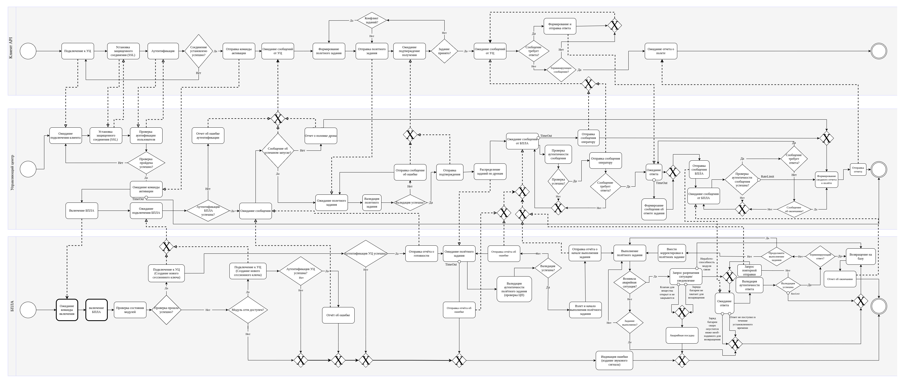

- [Дрон-опрыскиватель](#дрон-опрыскиватель)
  - [Цель](#цель)
  - [Бизнес-процесс](#бизнес-процесс)
  - [Цели и предположения безопасности](#цели-и-предположения-безопасности)
    - [Предположения безопасности](#предположения-безопасности)
  - [Требования](#требования)
    - [Дополнительные ограничения для реализации прототипа](#дополнительные-ограничения-для-реализации-прототипа)
  - [Описание архитектуры](#описание-архитектуры)
  - [Сценарии для сквозного функционального тестирования](#сценарии-для-сквозного-функционального-тестирования)
    - [Сценарий №1](#сценарий-1)
    - [Сценарий №2](#сценарий-2)
    - [Сценарий №3](#сценарий-3)
    - [Сценарий №4](#сценарий-4)
  - [Примеры негативных сценариев](#примеры-негативных-сценариев)
  - [Упрощения](#упрощения)
  - [Подсистемы, запущенные на БПЛА](#Подсистемы-запущенные-на-БПЛА)

# Дрон-опрыскиватель

## Цель
Необходимо создать программное обеспечение (далее – ПО) для беспилотного летательного аппарата (далее – дрон), с помощью которого можно обеспечить безопасное управление через мобильное приложение или управляющий центр (далее – УЦ) и выполнение задач дроном.
К задачам дрона относим: распыление пестицидов или удобрений (далее – смесь) по заданному участку или сброс нужного количества смеси в конкретных координатах.

## Бизнес-процесс

## Цели и предположения безопасности
Цель безопасности дрона
+ дрон должен выполнять только авторизованные задания
+ получение задания только от корпоративного сервера
+ в случае многократных попыток неавторизованного доступа вернуться на базу

### Предположения безопасности

Целями безопасности дрона не являются
+ защита от атак с использованием физического доступа
+ защита от намеренного искажения GPS координат

## Требования

Необходимо создать ПО, в котором будут реализованы следующие функции для корректной работы дрона:
1. Обмен данными с УЦ:
прием и отправка сообщений.
2. Выполнение команд, принятых от мобильного приложения и УЦ.
3. Геолокация:
позиционирование на местности.
4. Автономность:
выполнение программы распыления смеси,
защита в случае попытки перехвата управления или многократных попыток передачи некорректных сообщений,
действия в случае потери связи.
5. Контроль:
уровень заряда,
количество смеси,
обработка территории,
распознавание живых объектов (животных и людей),
поломка.
6. Мониторинг происходящего на земле:
распыление смеси только на землю или растения.
7. Возврат на базу в случае нештатных ситуаций. База имеет фиксированные координаты (x1,y1,z1).

### Дополнительные ограничения для реализации прототипа

Между собой сервисы общаются через шину сообщений (message bus), а всё снаружи принимают в виде REST запросов.

## Описание архитектуры

## Сценарии для сквозного функционального тестирования

### Сценарий №1
1. Включение дрона
2. Инициализация управления полетом
3. Получение полетного задания
4. Сообщение о начале полета
5. Достижение района выполнения работ
6. Активация управления распрыскивателем
7. Выполнение полетного задания
8. Выключение распрыскивателя
9. Сообщение о завершении работ
10. Возвращение на базу
11. Отчет о выполнении полетного задания

### Сценарий №2
1. Включение дрона
2. Получение полетного задания
3. Сбой в получении полетного задания
4. Отправка сообщения об ошибке полетного задания в УЦ

### Сценарий №3
1. Включение дрона
2. Получение полетного задания
3. Выполнение полетного задания
4. Сообщение о потери позиционирования
5. Активация инерционной навигационной системы
6. Аварийный возврат на базу
7. Уведомление об аварийном завершении полета УЦ

### Сценарий №4
1. Включение дрона
2. Инициализация управления полетом
3. Получение полетного задания
4. Сообщение о начале полета
5. Достижение района выполнения работ
6. Активация управления распрыскивателем
7. Выполнение полетного задания
8. Сообщение об обнаружении помехи
9. Выключение распрыскивателя
10. Возврат в зону проведения работ
11. Активация управления распрыскивателем
12. Сообщение о завершении работ
13. Возвращение на базу
14. Отчет о выполнении полетного задания

## Примеры негативных сценариев

1. Компрометация мобильного приложения. Получен доступ к файловому хранилищу телефона и временным файлам приложения.
Таким образом, для стороннего использования доступны разнообразные данные, например данные геолокации, персональные данные, учетные записи, финансовая информация и т.д.

2. Компрометация сервиса передачи данных, внедрение в полетное задание недостоверной информации. Таким образом, доступна подмена пакета при передаче через промежуточные звенья и возможен перехват управления дроном.
В том числе, через дрон возможно взломать центр управления и сфальсифицировать все полетные задания. Одна емкость с химикатами особо может ни на что не повлияет, а если скрытно почти незаметно вмешиваться в работу, так чтобы это не сразу отследили, то можно за десятки и сотни вылетов диверсию осуществлять.

## Упрощения
Смесь не имеет массы и объёма.
Графический интерфейс для взаимодействия с пользователем не требуется, достаточно примеров REST запросов.
В рамках игры для простоты компонентам следует использовать одинаковый подход передачи сообщений и ограничиться имитатором API.
Приборная точность позиционирования достаточна для выполнения полётного задания.

## Подсистемы, запущенные на БПЛА

| Название | Назначение | Комментарий |
|----|----|----|
|*Connector* | Отвечает за связь между модулем управления полётом и управляющим центром | Передает задачи, события и другую информацию |
|*Fly_control* | Контролирует состояние дрона. Контролирует исполнение полетного задания. Отслеживает позиционирование дрона в 3D. | В задаче использует только API. |
|*Navigate_module_GPS* | Выдаёт текущие координаты (x, y, z). Отслеживает прерывание сигнала.  | Отслеживает ошибки позиционирования. |
|*Navigate_module_inertional*  | Ведет GPS-независимую карту полета. | Строит аварийный маршрут возвращения на базу. |
|*Visual_control_camera* | Ведет видеосхемку и анализ кадров "на земле" | Контролирует появление наземных объектов (люди, животные) в месте распрыскивания смеси |
|*Visual_control_lidar* | Создает лидарное облако для пространства вокруг БПЛА | |
|*HW_control* | Контролирует уровень заряда батареи. Контролирует состояние распрыскивателя. Контролирует уровень смеси (сколько осталось). Контролирует состояние прочих модулей дрона. | |
|*Sprayer* | Контролирует расход смеси. Отключает и включает распрыскиватель в заданных точках маршрута. Управляет аварийным выключением распрыскивателя. | |
|*Security monitor* (монитор безопасности) | авторизует операцию, если она удовлетворяет заданным правилам или блокирует её в противном случае| |
|*Message bus* | шина сообщений и брокер - сервис передачи сообщений от источника получателям | kafka+zookeeper |

## Внешние сущности

### Управляющий центр
Создает полетные задания для дронов.
Распределяет полетные маршруты и проверяет их на безопасность с точки зрения пересечения.
Ведет реестр ошибок и аварийных ситуаций.
Регистрирует результаты выполнения полетных заданий.
Взаимодействует с дроном через API.

### Client API
Получает информацию о состоянии дрона в течении всего периода взаимодействия/управления полетом.
Передает дрону различные команды (запуск, установка плата полёта).
Взаимодействует с дроном через API.

### Оператор
Взаимодействует с дроном через Client API.
Для авторизации нужен логин и пароль.

